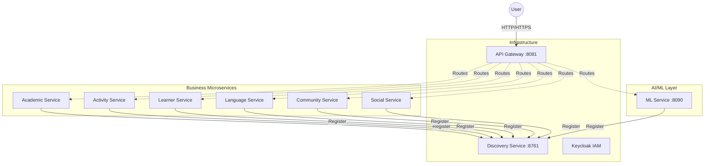

# 🚀 DevUnity — Platform E-Learning — Jungle In English


> **DevUnity** is a state-of-the-art microservices-based platform designed to bridge the gap between academic learning and professional recruitment. It leverages AI/ML to provide predictive analytics, automated CV screening, and personalized learning paths.

---

## 📋 Table of Contents

- [Architecture Overview](#️-architecture-overview)
- [Microservices Breakdown](#-microservices-breakdown)
- [Technology Stack](#️-technology-stack)
- [AI Core Features](#-ai-core-features)
- [Getting Started](#-getting-started)
- [Security Configuration](#-security-configuration)
- [API Documentation](#-api-documentation-swagger)
- [Contributing](#-contributing)
- [License](#-license)

---

## 🏗️ Architecture Overview

The project follows a **Microservices Architecture**, ensuring scalability, fault tolerance, and independent deployment of specialized services.

### 🧩 System Architecture Diagram



---

## 🧩 Microservices Breakdown

Each microservice is built with a **layered architecture** (Controller → Service → Repository → Entity → DTO → Feign Client).

| Service | Port | Base Path | Responsibility |
|:---|:---:|:---|:---|
| **API Gateway** | `8081` | `/` | Entry point, routing, and CORS management |
| **Discovery Service** | `8761` | `/eureka` | Service registry for dynamic service discovery |
| **Academic Management** | `8086` | `/academics/api` | Courses, enrollments, quiz management, and Cloudinary integration |
| **Activity Management** | `8084` | `/activities/api` | Recruitment, applicant tracking, and professional events |
| **Learner Management** | `8085` | `/learners/api` | Student profiles, dropout forms, and prediction integration |
| **ML Service** | `8090` | `/ml/api` | FastAPI-driven AI (Dropout prediction, CV Analysis) |
| **Social Interaction** | `8082` | `/socials/api` | Messaging, reporting, and community feedback |
| **Community Engagement** | `8083` | `/communities/api` | Club management and event organization |
| **Language Courses** | `8087` | `/languages/api` | Specialized Business/Children English modules |

---

## 🛠️ Technology Stack

### Backend & AI

| Category | Technologies |
|:---|:---|
| **Frameworks** | Spring Boot 3.2.x, Spring Cloud (Gateway, Eureka, OpenFeign) |
| **Security** | Keycloak (OIDC / OAuth2 / JWT) |
| **Database** | MySQL (per-service schema isolation) |
| **AI/ML Engine** | Python FastAPI, Scikit-learn, NLP |
| **Media Storage** | Cloudinary (cloud-based image/video management) |
| **Messaging** | WebSockets (StompJS), Spring Mail (SMTP) |

### Frontend

| Category | Technologies |
|:---|:---|
| **Framework** | Angular 18 (Server-Side Rendering enabled) |
| **Styling** | Tailwind CSS (Premium SaaS UI Design) |
| **State Management** | RxJS & Observables |
| **Interactions** | Vapi AI (Voice) & Lucide Icons |

### DevOps & Infrastructure

| Category | Technologies |
|:---|:---|
| **Containerization** | Docker (multi-stage builds) |
| **Orchestration** | Kubernetes (MicroK8s / K3s) |
| **CI/CD** | Jenkins Pipelines (Build → Test → SonarQube → Push → Deploy) |
| **Monitoring** | SonarQube, Prometheus / Grafana ready |

---

## 🤖 AI Core Features

| Feature | Description |
|:---|:---|
| 📉 **Dropout Prediction** | Uses behavioral data to predict if a student is at risk of dropping out |
| 📄 **Smart CV Analysis** | Automated scoring and clustering of candidates based on job requirements |
| 🇬🇧 **CEFR Level Testing** | Evaluates oral and written text to determine English proficiency (A1 → C2) |
| 🎓 **Course Recommender** | Personalized learning paths based on performance and test results |

---

## 🚀 Getting Started

### Prerequisites

- **Java 17+**
- **Node.js 18+**
- **Python 3.9+**
- **Docker & Kubernetes**
- **MySQL Instance**
- **Keycloak Server** (Realm: `devunity`)

### 🛠️ Step-by-Step Installation

#### 1. Clone the repository

```bash
git clone https://github.com/saifelislem/Esprit-PIDEV-4SAE7-2026-DEVUNITY.git
cd Esprit-PIDEV-4SAE7-2026-DEVUNITY
```

#### 2. Start Infrastructure Services *(start these first)*

- Start **Discovery Service** → Port `8761`
- Start **API Gateway** → Port `8081`
- Ensure **Keycloak** is running and configured

#### 3. Start Backend Services

```bash
cd Back-PIDEV-4SAE7-2026-DEVUNITY
# Example: start the Academic Service
cd Academic_Management_Service
mvn spring-boot:run
```

#### 4. Start ML Service (FastAPI)

```bash
cd Back-PIDEV-4SAE7-2026-DEVUNITY/ML_Dropout_Service
pip install -r requirements.txt
python app/main.py  # Runs on port 8090
```

#### 5. Start Frontend

```bash
cd Front-PIDEV-4SAE7-2026-DEVUNITY
npm install
npm start  # Access at http://localhost:4200
```

---

## 🔐 Security Configuration

DevUnity uses **Keycloak** for centralized Identity and Access Management (IAM).

| Setting | Value |
|:---|:---|
| **Realm** | `devunity` |
| **Public Client** | `devunity-app` — Angular frontend |
| **Confidential Client** | `devunity-service` — Backend microservices |
| **Roles** | `ADMIN`, `TUTOR`, `STUDENT`, `EMPLOYEE`, `PARENT` |

---

## 📑 API Documentation (Swagger)

Once the services are running, access the API docs via Swagger UI:

| Service | URL |
|:---|:---|
| **Academic Service** | http://localhost:8086/swagger-ui/index.html |
| **ML Service** | http://localhost:8090/docs *(FastAPI Swagger)* |
| **API Gateway** | http://localhost:8081/webjars/swagger-ui/index.html |

---

## 🤝 Contributing

Contributions are welcome! Follow these steps:

1. **Fork** the project
2. Create your feature branch
   ```bash
   git checkout -b feature/AmazingFeature
   ```
3. Commit your changes
   ```bash
   git commit -m 'Add some AmazingFeature'
   ```
4. Push to the branch
   ```bash
   git push origin feature/AmazingFeature
   ```
5. Open a **Pull Request**

---

## 📝 License

Distributed under the **MIT License**. See [`LICENSE`](LICENSE) for more information.

---

<div align="center">
  Built with ❤️ by the <strong>DevUnity Team</strong> — Esprit 2026
</div>
