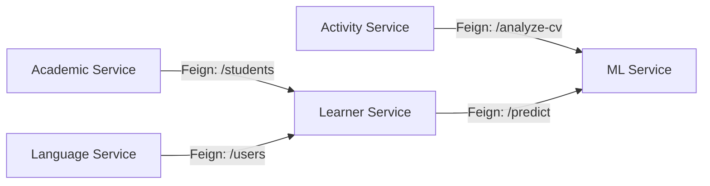

# 🧩 Architecture des Microservices — DevUnity

> **Rôle du document :** Détailler chaque microservice composant la plateforme DevUnity, ses responsabilités métiers, son périmètre et ses dépendances avec les autres services.

---

## 1. Services d'Infrastructure

### 🛡️ API Gateway (`Port 8081`)
- **Rôle** : Point d'entrée unique de la plateforme. Reverse proxy.
- **Responsabilités** :
  - Routage dynamique des requêtes (basé sur le path, ex: `/academics/**` vers `Academic Service`).
  - Gestion des politiques CORS globales.
- **Dépendances** : Eureka (pour découvrir les routes).

### 🔍 Discovery Service (Eureka) (`Port 8761`)
- **Rôle** : Registre centralisé des services.
- **Responsabilités** : Maintenir une liste à jour des instances de microservices disponibles.
- **Dépendances** : Aucune.

---

## 2. Microservices Métier (Spring Boot)

### 🎓 Academic Management Service (`Port 8086`)
- **Domaine** : Gestion de l'apprentissage classique.
- **Responsabilités** : Gestion des cours, modules, quiz, évaluations, et inscriptions des étudiants. Intégration avec Cloudinary pour les supports de cours.
- **Dépendances** : Learner Service (pour vérifier les profils étudiants).

### 💼 Activity Management Service (`Port 8084`)
- **Domaine** : Insertion professionnelle et parascolaire.
- **Responsabilités** : Offres d'emploi/stage, candidatures, gestion des recruteurs (Employee), organisation d'ateliers et d'événements professionnels.
- **Dépendances** : 
  - Learner Service (pour les profils candidats).
  - ML Service (pour l'analyse et le scoring des CV via IA).

### 👤 Learner Management Service (`Port 8085`)
- **Domaine** : Cœur des utilisateurs étudiants.
- **Responsabilités** : Profils étudiants complets, suivi des performances globales, gestion des tuteurs, et détection des risques de décrochage scolaire. Intégration Gemini AI pour le tutorat virtuel.
- **Dépendances** : ML Service (pour la prédiction de décrochage).

### 🌍 Language Courses Service (`Port 8087`)
- **Domaine** : Formation linguistique spécialisée.
- **Responsabilités** : Cours d'anglais spécifiques (Business English, Jungle in English pour enfants), tests de niveau CECRL, challenges interactifs (Word Battles).
- **Dépendances** : Academic Service (pour la structure des cours).

### 🤝 Community Engagement Service (`Port 8083`)
- **Domaine** : Vie associative et communautaire.
- **Responsabilités** : Gestion des clubs étudiants, adhésions, événements associatifs, forums de discussion et partage de ressources.
- **Dépendances** : Learner Service.

### 💬 Social Interaction Service (`Port 8082`)
- **Domaine** : Communication temps-réel.
- **Responsabilités** : Messagerie instantanée, notifications système, gestion des réclamations/signalements.
- **Dépendances** : Tous les autres services (pour l'envoi de notifications asynchrones).

---

## 3. Microservice Intelligence Artificielle

### 🤖 ML Dropout Service (`Port 8090` - FastAPI)
- **Rôle** : Moteur d'inférence pour les modèles de Machine Learning.
- **Responsabilités** :
  - Fournir des prédictions sur le risque de décrochage d'un étudiant (Churn Prediction) basé sur un modèle pré-entraîné (`joblib`).
  - Analyser les CV soumis (NLP) pour extraire les compétences et générer un score d'adéquation avec une offre.
- **Dépendances** : Eureka (pour s'enregistrer et être joignable par les services Spring Boot).

---

## 4. Carte des Dépendances (Inter-services)

Les communications synchrones entre services s'effectuent via **OpenFeign**, en utilisant les noms enregistrés dans Eureka, ce qui garantit le découplage et la résilience.

